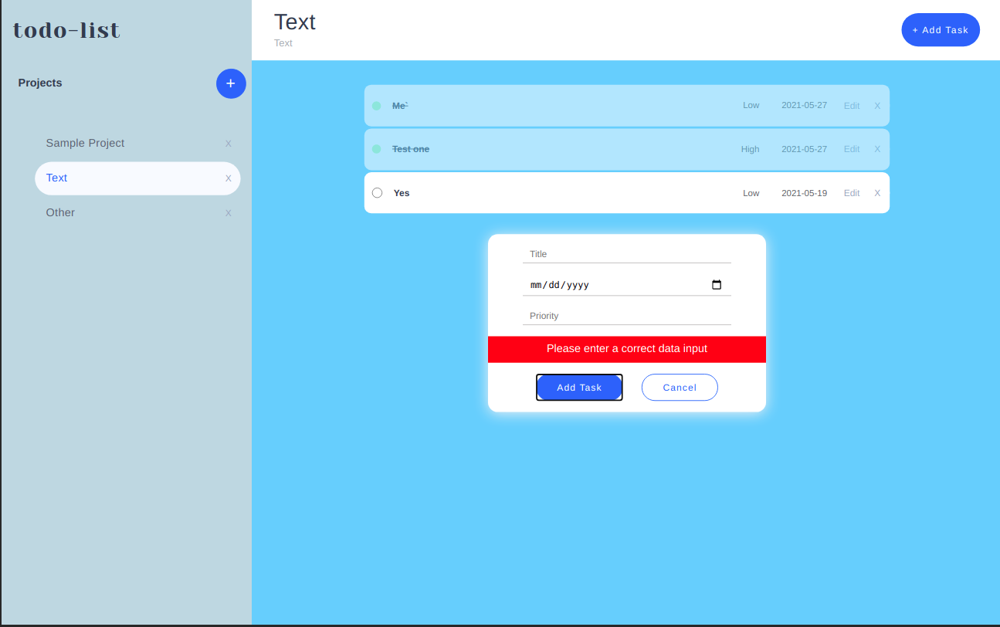

# TODO List 

> This project is part of Javascript Module with the aim of building an advanced TODO List with plain Javascript

<p align="center">
    <a href="https://img.shields.io/badge/Microverse-blueviolet" alt="Contributors">
        </a>
    <a href="https://www.javascript.com/" alt="JS">
        </a>
    <a href="https://webpack.js.org//" alt="Webpack">
        </a>
    <a href="https://eslint.org/" alt="Eslint">
        </a>
    <a href="https://stylelint.io/" alt="Stylelint">
        </a>
</p>

<p align="center">
    <br />
    <br />&#10023;
    <a href="#Prerequisites">Watch the Live Version</a> &#10023;
    <a href="#Prerequisites">Prerequisites</a> &#10023;
    <a href="#Getting-Started">Getting Started</a> &#10023;
    <a href="#Usage">Usage</a> &#10023;
    <a href="#Contributing">Contributing</a> &#10023;
    <a href="#Author">Author</a> &#10023;
    <a href="#Show-your-support">Show your support</a> &#10023;
    <a href="#License">License</a> &#10023;
    <a href="#Acknowledgments">Acknowledgments</a> &#10023;
    <a href="https://github.com/pacyL2K19/todo-list/issues">Report Bug</a>&#10023;

</p>

<br/>

<b>TODO List </b> The main goal of this project is to understand the benefits of modularized code as well as the ability to set up a javascript application made of different modules using webpack and more advanced ES6 features



## Watch the Live Version

[Live Demo](https://pacyl2k19.github.io/todo-list/)

### Prerequisites

- JavaScript ES6
- Text Editor
- Git
- NodeJS
- Webpack

## Getting Started

1. Open Terminal.
2. Navigate to your desired location to download the contents of this repository.
3. Copy and paste the following code into the Terminal :
   ```bash
   $ git clone https://github.com/pacyL2K19/todo-list.git
   ```
4. Run `cd todo-list`
5. Install the needed dependencies 
    ```bash
    $ npm install
    ```
6. run
    ```bash
    npm run build
    ``` 
    to bundle scripts with **_webpack_** a static module bundler for modern JavaScript applications
    Then open the `dist/index.html` in a web browser
7. In develoment mode run 
    ```bash
    npm run start
    ```
    This will allow you to watch changes in entry files

### Usage
Lauch the local version of this project opening the `dist/index.html` file in the browser

## Contributing

This project was created for educational purposes as part of the Microverse web development curriculum; contributing is not accepted.

Feel free to check the [issues page](https://github.com/pacyL2K19/todo-list/issues).

## Author

👤 **Pacifique Linjanja**

- Github: [@pacyL2K19](https://github.com/pacyL2K19)
- Twitter: [@PacifiqueLinja1](https://twitter.com/PacifiqueLinja1)
- Linkedin: [Pacifique Linjanja](https://www.linkedin.com/in/pacifique-linjanja/)
### Show your support

Give a ⭐️ if you like this project!

## License

This project is licensed under the MIT License

